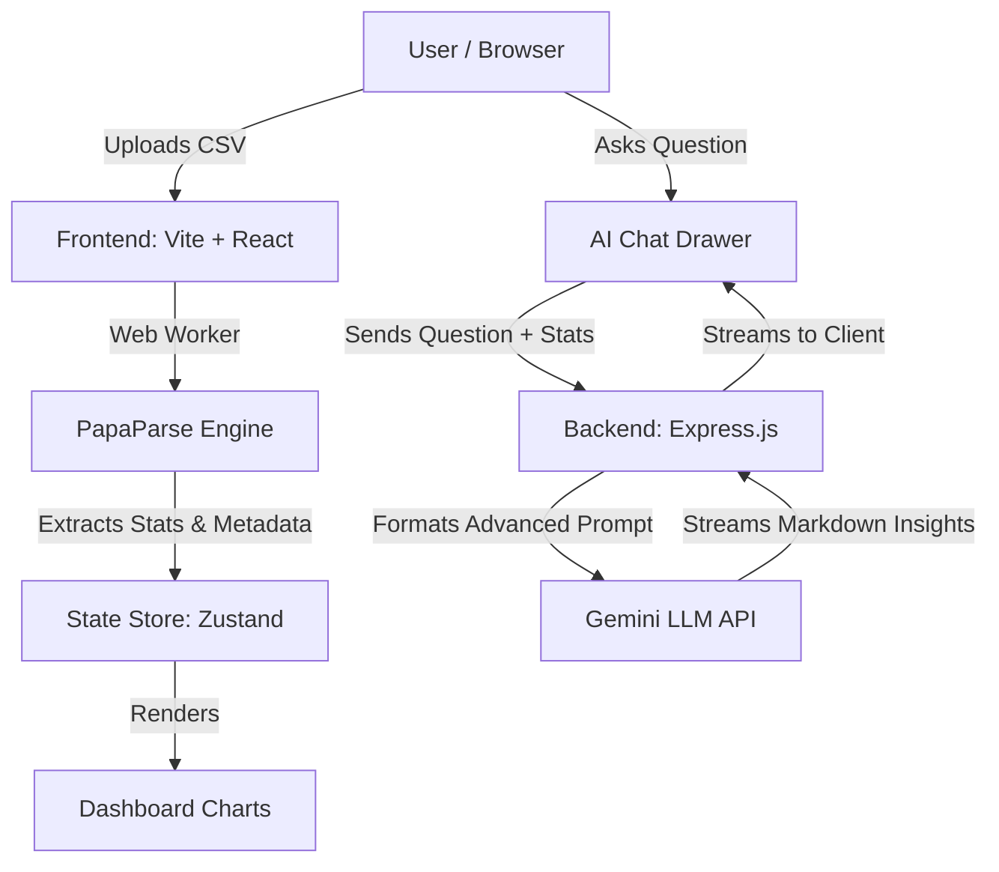

# Auto-EDA Data Analysis Platform

An enterprise-grade, ultra-fast automated Exploratory Data Analysis (EDA) and AI Intelligence platform. Designed for high performance, it processes massive datasets in the browser using Web Workers and leverages advanced LLMs to provide FAANG-tier data science insights.

## 🌟 Features

- **Ultra-Fast Processing:** Client-side CSV parsing utilizing Web Workers to ensure 60fps UI performance even with large files.
- **Automated Intelligence:** Instantly generates statistical distributions, correlation hypothesis, and recommended visualizations.
- **Elite AI Data Scientist:** An integrated AI Chat Drawer powered by Google's Gemini Flash/Pro, prompted to act as a Lead Data Scientist, providing deep anomaly detection, business insights, and predictive modeling suggestions.
- **Premium Aesthetics:** Stunning 3D particle background using `Three.js` + `@react-three/fiber`, smooth layout transitions via `Framer Motion`, and a glassmorphism Light/Dark mode.
- **Monorepo Architecture:** Seamlessly separated backend and frontend codebases unified under a single repository for streamlined CI/CD.

## 🏗 System Architecture



## 🚀 Tech Stack

- **Frontend:** React 19, Vite, TypeScript, Three.js, React Three Fiber, Framer Motion, Zustand, PapaParse, Chart.js, Recharts, Bootstrap
- **Backend:** Node.js, Express, TypeScript, Google GenAI SDK

---

## 💻 Local Development

### Prerequisites
- Node.js v20+
- A Google Gemini API Key

### 1. Setup Backend
```bash
cd backend
npm install
```
Create a `.env` file in the `backend` directory:
```env
VITE_GEMINI_API_KEY=your_gemini_api_key_here
PORT=3000
```
Start the backend development server:
```bash
npm run dev
```

### 2. Setup Frontend
In a new terminal:
```bash
cd frontend
npm install
```
Start the frontend development server:
```bash
npm run dev
```

---

## 🌍 Deployment Guide

This project is structured as a monorepo, making it highly efficient to deploy separate services from a single Git repository.

### Frontend (Vercel)
1. Go to Vercel and import your GitHub repository.
2. Under "Framework Preset", select **Vite**.
3. **CRITICAL STEP:** Set the **"Root Directory"** to `frontend`.
4. Add any frontend environment variables if necessary.
5. Click **Deploy**. Vercel will automatically run `npm run build` inside the `frontend` folder.

### Backend (Render)
1. Go to Render.com and create a new **Web Service**.
2. Connect your GitHub repository.
3. **CRITICAL STEP:** Set the **"Root Directory"** to `backend`.
4. Set the Build Command to: `npm install && npm run build`
5. Set the Start Command to: `npm run start`
6. Add your Environment Variable: `VITE_GEMINI_API_KEY`.
7. Click **Deploy**. Render will host the backend.

---

## 🔮 Future Enhancements
- Support for Excel (`.xlsx`) and Parquet files via WebAssembly.
- Automated Python/Jupyter Notebook export.
- Database connector integrations (PostgreSQL, Snowflake).
